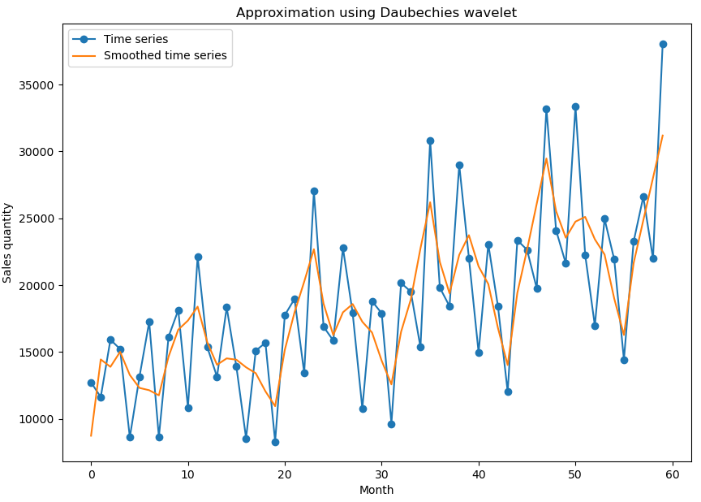

# Wavelet transform library

This is a wavelet transform library that can be used for example for time series approximation or image compression.

# Usage

Using wavelet transform to approximate time series

First, let's load the data

```python
df = pd.read_csv("C:\\Users\\Orin\\Downloads\\Month_Value_1.csv", parse_dates=['Period'], dayfirst=True)
df = df.iloc[:60]

x = np.arange(0, len(df['Sales_quantity']))
y = df['Sales_quantity'].to_numpy()
```

Now you can use to approximate the data using the following code where we remove the noise at the first level.

```python
wt = WaveletTransformHaar(y)
wt.set_to_zero_details(0)
approximations = wt.inverse_transform(0)
```

Let's plot the result

```python
plt.figure(figsize=(10, 7))

plt.plot(x, y, marker='o', label='Time series')
plt.plot(x, approximations, label='Smoothed time series')

plt.legend()
plt.xlabel('Month')
plt.ylabel('Sales quantity')
plt.title('Time series')
plt.show()
```


|  |  |
|-----------------|-----------------|